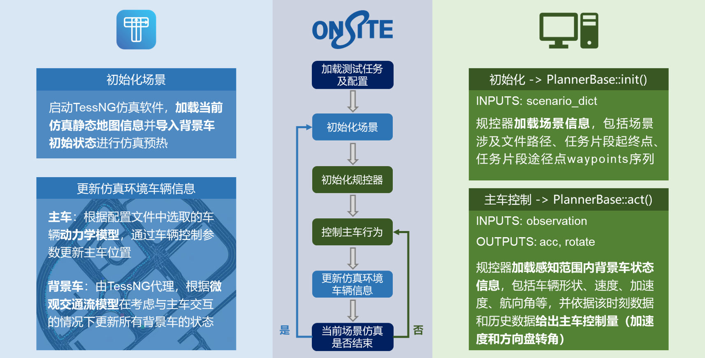
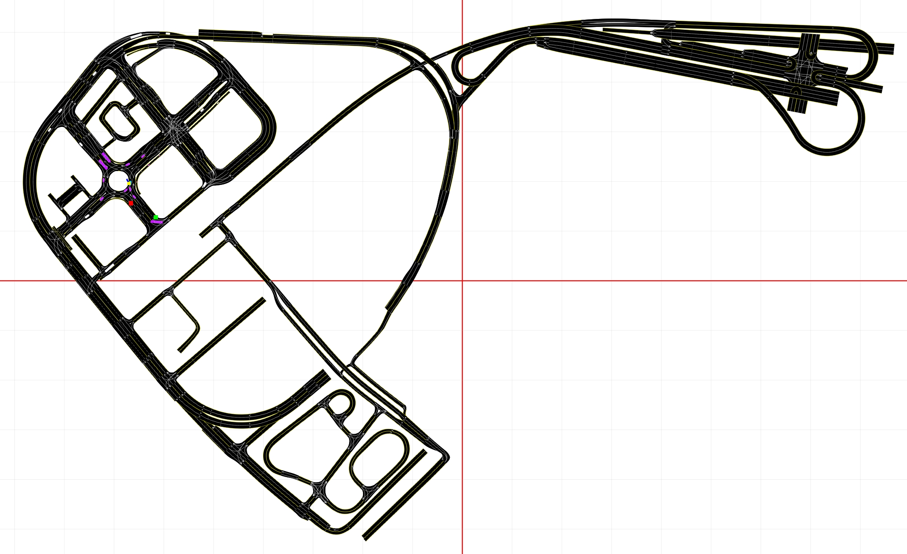

## 双向交互模块使用说明

### 接入流程


### 环境配置
   1. 使用conda建立虚拟环境，需指定版本为**python3.6.6**
      `conda create -n onsite python=3.6.6`
   2. 激活虚拟环境
      `conda activate onsite`
   3. 载入依赖库
      `pip install -r requirements.txt`

### 场景文件说明
```bash
   senario
   ├── replay
   │   ├── intersection_12_61_0
   │   │   ├── xxxx.json
   │   │   ├── xxxx.xodr
   │   │   └── xxxx.xosc
   │   └── ...
   ├── fragment
   │   ├── 0019cutin1
   │   │   ├── xxxx.tess
   │   │   ├── xxxx.xodr
   │   │   └── xxxx.xosc
   │   └── ...
   └── serial
       ├── maps	
       │   ├── TJST
       │   │   ├── xxxx.xodr
       │   │   └── xxxx.tess
       │   └── ...
       └── tasks
           ├── xxxx.json
           └── ...
```
   1. 回放测试场景文件`senario/replay`
      + 该文件夹下存放各片段场景目录，文件夹名称即为场景名
      + 二级场景文件夹下存放对应的*静态路网文件(.xodr)*、*动态车辆信息(.xosc)*和*信控信息(.json)*
   2. 片段式双向交互测试场景文件`senario/fragment`
      + 该文件夹下存放各片段场景目录，文件夹名称即为场景名
      + 二级场景文件夹下存放对应的*静态路网文件(.xodr)*和*动态车辆信息(.xosc)*
   3. 无限里程双向交互测试场景文件`senario/serial`
      + `maps`文件夹中存放所有测试任务共用的静态地图文件，地图文件夹下包含*xodr格式路网*和*tess二进制启动文件*
      + `tasks`文件夹中存放各测试任务(.json)文件，每个json文件中包含测试任务对应的*静态地图(map)*、*测试起点(startPos)*、*测试终点面域(targetPos)*及*参考轨迹路径(waypoints)*
      > json文件中静态地图名称与maps文件夹下静态地图文件夹名称保持一致 

### 配置文件说明
   1. 测试任务配置`config/tasks.yaml`
      + 该配置文件可以分别指定三种测试模式的具体**测试方法和内容**
      + `REPLAY` 回放测试配置
         - `tasks`：指定测试任务，以列表形式给出。列表中每一项为测试场景名称，对应回放测试场景文件夹`senario/replay`下的二级文件夹名称
         - `visualize`：是否开启可视化界面(默认为False)
      + `FRAGMENT` 片段式双向交互测试配置
         - `tasks`：指定测试任务，以列表形式给出。列表中每一项为测试场景名称，片段式双向交互测试场景文件夹`senario/fragment`下的二级文件夹名称
         - `dt`：仿真测试频率(默认仿真时间间隔为0.05s)
         - `maxTestTime`: 单测试任务最大测试时长，当单个测试任务超过此时限时会被自动中断
      + `SERIAL` 无限历程双向交互测试配置
         - `tasks`：指定测试任务，以列表形式给出。列表中每一项为测试场景名称，无限里程双向交互测试任务文件夹`senario/serial/tasks`下json文件名称
         - `dt`：仿真测试频率(默认仿真时间间隔为0.05s)
         - `maxTestTime`: 单测试任务最大测试时长，当单个测试任务超过此时限时会被自动中断

### 规控算法编写说明
   用户需要在`planner`文件夹内新建文件夹并以`plannerBase.py->PlannerBase`作为基类编写自己的规划控制类
   > 具体形式可以参考planner中给出的两个样例规控器（IDM和Manual）

   1. `__init__(self) -> None`
      + 功能：构造函数，用于生成规划控制类对应的实例
      + 调用时间：尽在所有测试任务开始前被调用一次
   2. `init(self, scenario_info: dict) -> None`
      + 功能：初始化函数，通过变量向规控器传入当前测试任务具体信息
      + 调用时间：在加载每个测试任务前调用，调用次数与测试任务数量一致
      + 传入参数：`scenario_info`类型为字典，包含字段说明如下：
         - `scenarioNum`: 整型，表示当前测试模式下的测试场景编号
         - `scenarioName`: 字符串，表示当前测试任务名称
         - `scenarioType`: 字符串，表示当前测试模式
         - `xodr_file_path`: 字符串，表示当前测试任务中对应路网文件路径，用于选手对地图进行解析
         - `startPos`: 列表，表示测试任务中主车的发车点x,y坐标
         - `targetPos`: 列表，表示测试任务的终点面域
         - `waypoints`: 列表，表示测试任务的参考轨迹点序列 *(仅当测试模式为无限里程双向交互测试时有值，其余测试模式下为空列表)*
   3. `act(self, observation: Observation) -> [float, float]`
      + 功能：响应函数，读入当前时刻的仿真环境状态信息，返回主车的控制量
      + 调用时间：在测试任务的每个测试时调用，调用次数与测试任务数量一致
      + 传入参数：`observation`类型为utils/observation.py中的`Observation`类，包含变量说明如下：
         1. `Observation.vehicle_info`: 仿真环境车辆信息，变量类型为字典，组织形式形如下：
            ```json
            {
               'ego': {
                  'length': 4.75,
                  'width': 2.02,
                  'x': 407.705,
                  'y': 4.455,
                  'v': 39.98,
                  'a': 0,
                  'yaw': 3.141592653589793,
               },
               1: {
                  'x': 172.77,
                  'y': 8.33,
                  'v': 28.42,
                  'a': 0,
                  'yaw': 3.142,
                  'width': 2.22,
                  'length': 4.85,
               },
               ...
            }
            ```
            + **键值对数目**为该场景中包含的车辆数*（主车及其周围50米范围的背景车）*
            + **键**为车辆id，主车为`ego`
            + **值**为车辆状态信息，其中参数说明如下：
               | 参数   | 单位  | 说明                             |
               | ------ | ----- | -------------------------------- |
               | x      | m     | 车辆当前帧所在位置横坐标         |
               | y      | m     | 车辆当前帧所在位置纵坐标         |
               | v      | m/s   | 车辆当前速度                     |
               | a      | m/s^2 | 车辆当前加速度                   |
               | yaw    | rad   | 车辆当前航向角（以x轴正方向为0） |
               | length | m     | 车辆长度                         |
               | width  | m     | 车辆宽度                         |
         2. `Observation.bicycle_info`: 仿真环境自行车信息，组织形式与车辆信息一致
         3. `Observation.pedestrian_info`: 仿真环境行人信息，组织形式与车辆信息一致
         4. `Observation.light_info`: 仿真环境信号灯信息，该字段仅在回放测试中使用，表示主车即将经过的路口红绿灯灯色
            + 键为仿真时间
            + 值为该时刻对应红绿灯状态，包含`green`,`yellow`,`red`三种灯色
         5. `Observation.test_info`: 仿真状态信息
            + `t`: 当前仿真时刻
            + `dt`: 当前任务仿真测试频率
            + `end`: 当前任务是否结束
      + 返回参数：`[acceleration, streering_angel]`
         - `acceleration`为**加速度**，变量类型为`float`，单位为`m/s^2`
         - `streering_angel`为**方向盘转角**，变量类型为`float`，单位为`rad`

### 用户操作步骤
   1. 修改测试任务配置文件`config/tasks.yaml`，指定测试任务和参数
   2. 参考`规控算法编写说明`编写自己的规划控制类
   3. 修改`planner/__init__.py`中变量`PLANNER`的值，指向步骤2中编写好的规划控制类
   4. 运行`main.py`进行测试
      > 首次运行TessNG时需要导入激活密钥，点击`导入激活码`后选择`src/JidaTraffic_key.key`激活，提升激活成功后关闭程序重新运行即可
   5. 在`outputs`文件夹中查看所有测试的轨迹输出

### TessNG界面介绍

  1. 矩形标志： 
     + 绿色矩形：场景起始位置坐标 
     + 红色矩形：场景终点位置坐标 
     + 黄色矩形：测试车实际位置（与Observation中ego信息相同，蓝线为主车航向）
  2. 车辆标志： 
     + 蓝色车辆：测试车在TessNG路网中交互的投影（无实际意义）
     + 紫色车辆：记录在Observation中的背景车
     + 白色车辆：未记录在Observation中的其他背景车
  3. 点击TessNG GUI界面左侧边栏`显示路径`按钮可以展示当前场景下的waypoints序列 *(仅针对无限里程双向交互测试)*